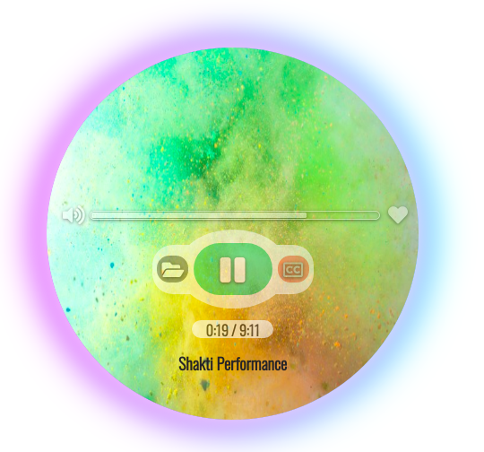

# MMM-VideoPlayer
A [MagicMirror²](https://github.com/MichMich/MagicMirror/) module for playing videos from any device on the network. A video object is built inside the module, no iframe is used. The best position is bottom left, although the position and size depends upon the user. The player has nice rounded and shadow borders which adds a nice aesthetic sense to the overall MM. The player then waits for the user to browse to the advertized URL and load a video/movie. On the advertized URL, a nice player awaits for the user to select the video file along with some controls such as Play/Pause, Volume, Mute, Subtitles.

This model is utilzing video streaming over HTTP, so the whole file is not read at once but in chunks as per the requirement. The module is built with error handling procedures. Beside the core modules, this module uses 4 other dependencies mentioned in the package file.

 <br>
 <br>
 <br>
 <br>

## Using the module

* Navigate to the modules directory via the follow command: `cd MagicMirror/modules`
* Clone the module from github: `git clone https://github.com/asimhsidd/MMM-VideoPlayer.git`
* Navigate to the MMM-VideoPlayer directory: `cd MMM-VideoPlayer`
* Install the dependencies: `npm install`
* Add the following configuration to the modules array in the `config/config.js` file:
```js
    modules: [
		{
			module: "MMM-VideoPlayer",
			position: "bottom_left",
			config:
			{
				playerWidth:"500",
				playerHeight:"370"
			}
		}
    ]
```

## ipWhitelist your network IP

For security reasons, the MagicMirror is not reachable externally. To change this, configure address, and ipWhitelist in your config.js (see [these lines in the sample config](https://github.com/MichMich/MagicMirror/blob/master/config/config.js.sample#L12-L22)). For example change address to 0.0.0.0 and add two allowed devices with IP-Adresses 192.168.0.42 and 192.168.0.50:
```js
address : '0.0.0.0',
    port: 8080,
    ipWhitelist: ["127.0.0.1", "::ffff:127.0.0.1", "::1", "::ffff:192.168.0.42", "::ffff:192.168.0.50"],"

```
